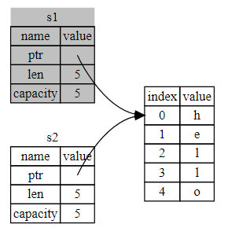
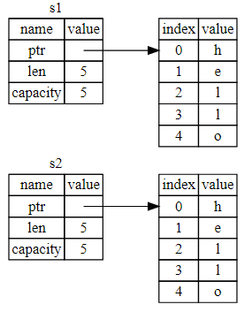
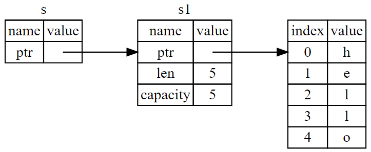
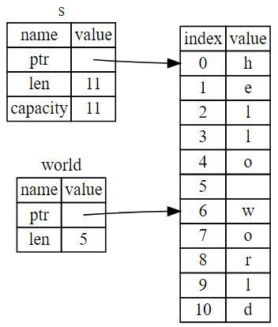

# Understanding Ownership
## What is Ownership?
Ownership rules:
* Each value in Rust has a variable that's called its owner.
* There can only be one owner at a time.
* When the owner goes out of scope, the value will be dropped.

Variable scope:
```rust
{ // s is not valid here, it's not yet declared 
    let s = "hello"; // s is valid from this point forward

    // do stuff with s
} // scope is now over, and s is no longer valid
```

### Move
```rust
let s1 = String::from("hello");
let s2 = s1;
```

Memory overlay: 

 

`s1` is no longer valid.

### Clone
A deep copy of the heap data. More expensive than a move.
```rust
let s1 = String::from("hello");
let s2 = s1.clone();
```

Memory overlay: 

 

### Copy
Types of data that are entirely on the stack (e.g.: integers), are easy to make, and therefore are just copied when creating a variable with the value of another variable. The types that allow copying all implement the `Copy` trait. Examples are:
* All the integer types.
* The Boolean type.
* All the floating point types.
* The character type.
* Tuples, if they only contain types that are also `Copy`.

Function arguments behave similarly to assigning a value to a variable - it will either move or copy the variable. Returning values from a function transfers ownership.

## References and Borrowing
```rust
fn main() {
    let s1 = String::from("hello");
	let len = calculate_length(&s1);
	println!("The length of '{}' is {}.", s1, len);
}
 
fn calculate_length(s: &String) -> usize {
	s.len()
}
```

References don't take ownership of a value. The value it points to will not be dropped when the refernce goes out of scope.



By default, references are also immutable. We're not allowed to modify something we have a reference to.  
References can be mutable: `&mut s` (assuming s is also mutable!).  
Mutable references have one big restriction: *you can have only one mutable reference to a particular piece of data in a particular scope.*  
Also, you can't have a mutable reference while you have an immutable one (having several immutable references is OK).  
A reference's scope starts from where it is introduced and continues through the last time that reference is used.
```rust
let mut s = String::from("hello");
let r1 = &s;
let r2 = &s;
println!("{} and {}", r1, r2);
// r1 and r2 are no longer used after this point
 
let r3 = &mut s;
println!("{}", r3);
```

In Rust, the compiler guarantees that references will never be dangling references - the compiler will ensure that the data will not go out of scope before the reference to the data does.

### Rules of references - Summary
* At any given time, you can have either one mutable reference or any number of immutable references.
* References must always be valid.

## The Slice Type
Slices let you reference a contiguous sequence of elements in a collection rather than the whole collection.  

A string slice is a reference to a part of a `String`. Example:
```rust
let s = String::from("hello world");
let hello = &s[0..5];
let world = &s[6..11];
```

Indices using a range are inclusive at the start, and exclusive at the end. Looks like this in the memory: 



You can drop the value before the two periods if you want to start at index zero:
```rust
let slice = &s[..2];
```

Same for the last index:
```rust
let slice = &s[3..];
```

String slice range indices must occur at valid UTF-8 character boundaries. If you attempt to create a string slice in the middle of a multibyte character, your program will exit with an error.  

An example function with slices:
```rust
fn first_word(s: &String) -> &str {
	let bytes = s.as_bytes();
	 
	for (i, &item) in bytes.iter().enumerate() {
		if item == b' ' {
			return &s[0..i];
		}
	}
	&s[..]
}
```

A way to improve the previous function would be to change its signature to allow us to use it both on `&String` and `&str` values:
```rust
fn first_word(s: &str) -> &str { ... }
```