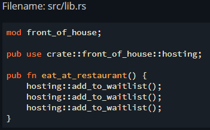
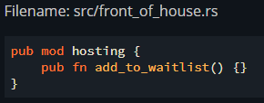
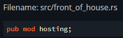
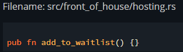

# Managing Growing Projects with Packages, Crates, and Modules
## The Features of the Module System
* **Packages**: A cargo feature that lets you build, test, and share crates
* **Crates**: A tree of modules that produces a library or executable
* **Modules and Use**: Let you control the organization, scope, and privacy of paths
* **Paths**: A way of naming an item, such as a struct, function, or module

## Packages and Crates
A crate is a binary or a library. The crate root is a source file that the Rust compiler starts from and makes up the root module of your crate.  
A package is one or more crates that provides a set of functionality. The `Cargo.toml` file describes how to build those crates.  
A package must contain up to one library, and at least one crate.  

### Name conventions
* src/main.rs - Crate root of a binary crate.
* src/lib.rs - Crate root of a library crate.
* src/bin - A package can have multiple binary crates by placing files in this directory. Each file is a separate binary.

## Defining Modules to Control Scope and Privacy
An example module:
```rust
mod example_module {
    // -- body - can contain modules, functions, structs, enums, etc. --
}
```

## Paths for Referring to an Item in the Module Tree
2 ways to import in rust:
1. Absolute: `crate::front_of_house::hosting::add_to_waitlist();`
2. Relative: `front_of_house::hosting::add_to_waitlist();`

The `super` keyword exists, which acts sort of like `..` in the filesystem path.

## Bringing Paths into Scope with the `use` Keyword
The `use` keyword allows us to bring symbols into the scope of our code. There exists 2 ways to do it:
1. Absolute: `use crate::front_of_house::hosting;`
2. Relative: `use self::front_of_house::hosting;`

The idiomatic way to bring a function into scope is to bring its module into scope, so we will have to call it like that: `module_name::function_name();`. It makes it clear that the function isn't locally defined.  
On the other hand, when bringing in structs, enums, and other items with `use`, it's idiomatic to specify the full path, for example: `use std::collections::HashMap;`  

When bringing in two types with the same name, we can either import their parents instead, or we can use the `as` keyword: `use std::io::Result as IoResult;`  

We can re-export name with `pub use`: `pub use crate::front_of_house::hosting;` allows people importing our code to access hosting as well.  

In order to import external packages, we need to add the following lines to `Cargo.toml`:
```sh
[dependencies]
package_name = "version"
```

We can also use nested paths to import several paths that have some common part of a path:
```rust
//before
use std::cmp::Ordering;
use std::io;
//after
use std::{cmp::Ordering, io};

//before
use std::io;
use std::io::Write;
//after
use std::io::{self, Write};
```

The glob operator is also supported, for example: `use std::collections::*;`

## Separating Modules into Different Files
When used with a semicolon, `mod` loads the contents of the module from another file with the same name as the module. For example: 

 



We can continue even further with directories: 

 

